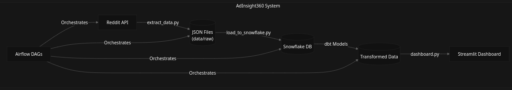
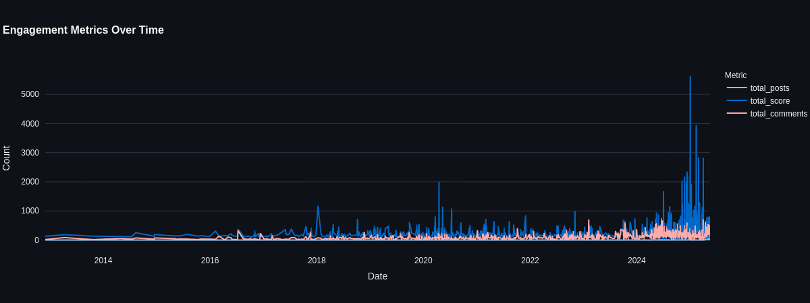
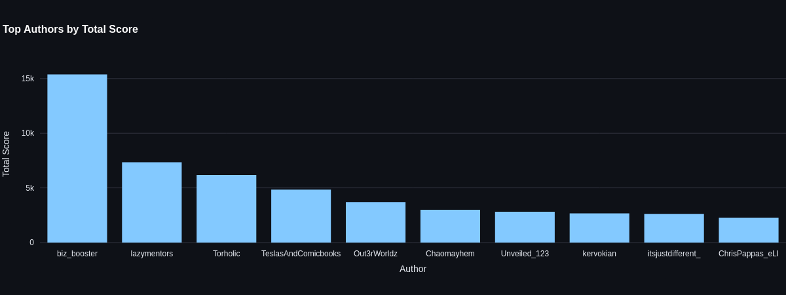
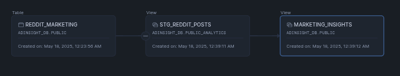

# AdInsight360

A data pipeline for extracting and analyzing marketing insights from Reddit data.

## Overview

This project automates the collection of marketing-related content from Reddit and loads it into Snowflake for analysis. The pipeline extracts posts from various Reddit categories (hot, new, and top posts) and maintains a structured database of marketing insights.

## System Architecture

*System architecture showing data flow from Reddit API to Streamlit dashboard*

The system consists of several key components:
1. **Data Extraction**: Automated Reddit data collection using PRAW
2. **Data Storage**: JSON files for raw data and Snowflake for processed data
3. **Data Transformation**: dbt models for data transformation and business logic
4. **Orchestration**: Airflow DAGs managing the entire pipeline
5. **Visualization**: Streamlit dashboard for interactive analytics

## Live Demo

🔗 **[Try the live demo](https://adinsight360-reddit-marketing-analytics.streamlit.app/)**

Experience the interactive dashboard and analytics features in action!

## Dashboard Preview

- *Real-time engagement metrics showing post performance and community interaction*

- *Author contribution analysis and trending metrics*

## Database Schema

- *AdInsight360 database schema showing relationships between staging and mart layers*

## Features

- Automated Reddit data extraction
- Duplicate post prevention
- Structured data storage in Snowflake
- Comprehensive post metadata collection:
  - Post titles and content
  - Engagement metrics (scores, comments)
  - Author information
  - Timestamps
  - URLs
- Interactive Analytics Dashboard:
  - Real-time engagement metrics
  - Content performance analysis
  - Author influence tracking
  - Trend visualization
  - Custom filtering and exploration
